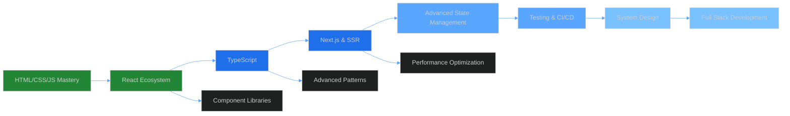

<div align="center">
  
</div>

<p align="center">
  
</p>

<p align="center">
  <a href="https://www.linkedin.com/in/shaaban-elnhas/"></a>
  <a href="https://github.com/ShaabanElnhas"></a>
  <a href="mailto:shaaban.elnhas@example.com"></a>
  <a href="https://twitter.com/ShaabanElnhas"></a>
</p>

<p align="center">
  
  
  
</p>

<br/>


<br/>

## 📌 Pinned Repositories

<div align="center">

[](https://github.com/ShaabanElnhas/Eat-N-Splite)
[](https://github.com/ShaabanElnhas/Crud-Project)

</div>

<br/>


<br/>

## 🎯 2024-2025 Goals

<div align="center">

| Goal | Status | Progress |
|------|--------|----------|
| 🎓 Master TypeScript | In Progress |  |
| 🚀 Build 5+ React Projects | In Progress |  |
| 🌟 Contribute to Open Source | Ongoing |  |
| 📚 Learn Next.js & SSR | In Progress |  |
| 💼 Land Dream Developer Role | Planning |  |
| 🎨 Improve UI/UX Skills | Ongoing |  |

</div>

<br/>


<br/>

## 🏆 Achievements & Certifications

<div align="center">

<table>
<tr>
<td align="center" width="50%">
<br/>
<strong>GitHub Trophies</strong><br/>
<sub>Recognition for contributions and activity</sub>
</td>
<td align="center" width="50%">
<br/>
<strong>Continuous Learning</strong><br/>
<sub>Always updating skills & knowledge</sub>
</td>
</tr>
</table>

<br/>

### 🎖️ Badges Earned


</div>

<br/>


<br/>

## 📝 Latest Blog Posts & Articles

<div align="center">

<!-- BLOG-POST-LIST:START -->
🚧 Coming Soon! Stay tuned for technical articles, tutorials, and insights about React development.
<!-- BLOG-POST-LIST:END -->

<br/>

<a href="https://dev.to/ShaabanElnhas" target="_blank">

</a>
<a href="https://medium.com/@ShaabanElnhas" target="_blank">

</a>
<a href="https://hashnode.com/@ShaabanElnhas" target="_blank">

</a>

</div>

<br/>


<br/>

## 🎵 Spotify Playing

<div align="center">

[](https://open.spotify.com/user/YOUR_SPOTIFY_USER_ID)

<sub>🎧 What I'm currently listening to while coding</sub>

</div>

<br/>


<br/>

## 💡 Fun Facts About Me

<div align="center">

<table>
<tr>
<td align="center">
<br/>
<strong>Coffee Enthusiast</strong><br/>
<sub>☕ Powered by caffeine and curiosity</sub>
</td>
<td align="center">
<br/>
<strong>Lifelong Learner</strong><br/>
<sub>📚 Always exploring new technologies</sub>
</td>
<td align="center">
<br/>
<strong>Problem Solver</strong><br/>
<sub>🧩 Love tackling complex challenges</sub>
</td>
</tr>
<tr>
<td align="center">
<br/>
<strong>Night Owl</strong><br/>
<sub>🌙 Most productive after sunset</sub>
</td>
<td align="center">
<br/>
<strong>Open Source</strong><br/>
<sub>💻 Believe in collaborative development</sub>
</td>
<td align="center">
<br/>
<strong>UI/UX Lover</strong><br/>
<sub>🎨 Passionate about beautiful designs</sub>
</td>
</tr>
</table>

</div>

<br/>


<br/>

## 🌐 Support My Work

<div align="center">

<p>If you like my projects and want to support my work, you can:</p>

<br/>

<a href="https://www.buymeacoffee.com/ShaabanElnhas" target="_blank">

</a>

<br/><br/>

<a href="https://github.com/sponsors/ShaabanElnhas" target="_blank">

</a>

<br/><br/>

**⭐ Star my repositories if you find them useful!**<br/>
**🍴 Fork and contribute to make them even better!**

</div>

<br/>


<br/>

## 📊 Weekly Development Breakdown

<!--START_SECTION:waka-->
```text
JavaScript   12 hrs 30 mins  ████████████░░░░░░░░░   48.50 %
React        8 hrs 15 mins   ████████░░░░░░░░░░░░░   32.00 %
CSS          3 hrs 20 mins   ███░░░░░░░░░░░░░░░░░░   12.90 %
HTML         1 hr 10 mins    █░░░░░░░░░░░░░░░░░░░░   04.50 %
JSON         32 mins         ░░░░░░░░░░░░░░░░░░░░░   02.10 %
```
<!--END_SECTION:waka-->

<br/>


<br/>

## 🎮 GitHub Profile 3D Contribution Graph

<div align="center">


</div>

<br/>


<br/>

<div align="center">

## 🙏 Thanks for Visiting!


<br/>

### If you like what you see, don't forget to:

⭐ **Star** some repositories<br/>
👀 **Follow** for updates<br/>
🤝 **Connect** on LinkedIn<br/>
💬 **Reach out** for collaborations

<br/>


<br/><br/>


</div>a-139a6edaec5c.gif">

<br/>

##  About Me


<br/>

🎯 **Passionate React Developer** crafting pixel-perfect user experiences

🌍 **Based in:** Egypt 🇪🇬

💼 **Current Role:** Frontend Developer specializing in React

🎨 **Design Philosophy:** "Good code is its own best documentation"

🔭 **Currently Working On:** Advanced React applications with modern architecture

🌱 **Learning Journey:** TypeScript, Next.js, and System Design

💡 **Ask Me About:** React, JavaScript, Frontend Architecture, UI/UX

⚡ **Fun Fact:** I can debug code faster than I can find my keys 🔑

🎮 **Hobbies:** Coding, Learning New Technologies, Open Source

<br/>

```typescript
const shaaban: Developer = {
  name: "Shaaban Elnhas",
  location: "Egypt 🇪🇬",
  role: "React Developer",
  company: "Freelance / Open to Opportunities",
  
  code: {
    languages: ["JavaScript", "TypeScript", "HTML", "CSS"],
    frameworks: ["React", "Next.js", "Vue.js"],
    styling: ["TailwindCSS", "Styled-Components", "SASS", "CSS Modules"],
    stateManagement: ["Redux", "Context API", "Zustand"],
    tools: ["Git", "Webpack", "Vite", "npm/yarn", "ESLint", "Prettier"]
  },
  
  architecture: {
    frontend: ["SPA", "SSR", "SSG", "Component-Driven Development"],
    design: ["Responsive Design", "Mobile-First", "Atomic Design"],
    testing: ["Jest", "React Testing Library"],
    performance: ["Code Splitting", "Lazy Loading", "Optimization"]
  },
  
  currentFocus: ["Advanced React Patterns", "Performance Optimization", "TypeScript"],
  openToWork: true,
  interests: ["Web3", "AI/ML", "Cloud Technologies"],
  
  motto: "Write code that speaks for itself 💎"
};
```

<br clear="both"/>


<br/>

##  Tech Stack & Tools

<div align="center">

### 💻 Frontend Development

<p>
  
  
  
  
  
  
  
  
</p>

### 🎨 Styling & UI

<p>
  
  
  
  
  
  
</p>

### ⚙️ Tools & Platforms

<p>
  
  
  
  
  
  
  
  
  
  
</p>

### 🗄️ Backend & Database (Familiar)

<p>
  
  
  
  
  
</p>

### 🚀 Deployment & Hosting

<p>
  
  
  
  
</p>

</div>

<br/>


<br/>

## 📊 GitHub Analytics

<p align="center">
  
  
</p>

<p align="center">
  
  
</p>

<div align="center">
  
</div>

<br/>

<details open>
<summary><h3>📈 Detailed Contribution Metrics</h3></summary>

<p align="center">
  
</p>

<p align="center">
  
  
  
</p>

</details>

<br/>


<br/>

## 🎯 Featured Projects

<div align="center">

### 🌟 Highlighted Repositories

<table>
<tr>
<td width="50%">
<h3 align="center">🍽️ Eat-N-Split</h3>
<div align="center">
<a href="https://github.com/ShaabanElnhas/Eat-N-Splite" target="_blank">

</a>
<br/><br/>
<p><strong>React • JavaScript • CSS</strong></p>
<p>A friendly React application designed to simplify bill splitting among friends. Features include managing friends, splitting bills efficiently, tracking balances in real-time, and a clean responsive UI.</p>
<a href="https://github.com/ShaabanElnhas/Eat-N-Splite" target="_blank">

</a>
</div>
</td>
<td width="50%">
<h3 align="center">📦 CRUD Product Manager</h3>
<div align="center">
<a href="https://github.com/ShaabanElnhas/Crud-Project" target="_blank">

</a>
<br/><br/>
<p><strong>HTML • CSS • Vanilla JavaScript</strong></p>
<p>A full-featured Product Management System with complete CRUD operations. Includes local storage persistence, search functionality, data validation, and responsive design for all devices.</p>
<a href="https://github.com/ShaabanElnhas/Crud-Project" target="_blank">

</a>
</div>
</td>
</tr>

<tr>
<td width="50%">
<h3 align="center">🎨 Kreasi Digital</h3>
<div align="center">
<a href="https://github.com/ShaabanElnhas/Kreasi-Digital" target="_blank">

</a>
<br/><br/>
<p><strong>HTML • CSS • JavaScript</strong></p>
<p>A creative digital agency website showcasing modern web design principles. Features smooth animations, responsive layouts, and an engaging user experience.</p>
<a href="https://github.com/ShaabanElnhas/Kreasi-Digital" target="_blank">

</a>
</div>
</td>
<td width="50%">
<h3 align="center">🚀 More Projects Coming Soon</h3>
<div align="center">

<br/><br/>
<p><strong>Currently Building...</strong></p>
<p>I'm constantly working on new and exciting projects. Stay tuned for innovative React applications, open-source contributions, and experimental web technologies!</p>
<a href="https://github.com/ShaabanElnhas?tab=repositories" target="_blank">

</a>
</div>
</td>
</tr>
</table>

</div>

<br/>


<br/>

## 🌱 My Learning Roadmap

<div align="center">



</div>

<br/>

<div align="center">

### 📚 Currently Learning

<table>
<tr>
<td align="center" width="25%">
<br/>
<strong>TypeScript</strong><br/>
<sub>Type-safe JavaScript</sub><br/>

</td>
<td align="center" width="25%">
<br/>
<strong>Next.js</strong><br/>
<sub>React Framework</sub><br/>

</td>
<td align="center" width="25%">
<br/>
<strong>Docker</strong><br/>
<sub>Containerization</sub><br/>

</td>
<td align="center" width="25%">
<br/>
<strong>GraphQL</strong><br/>
<sub>Query Language</sub><br/>

</td>
</tr>
</table>

</div>

<br/>


<br/>

## 💼 Experience & Interests

<div align="center">

<table>
<tr>
<td width="33%" align="center">
<br/>
<strong>Frontend Development</strong><br/>
<sub>Building responsive, performant, and accessible web applications with React and modern JavaScript</sub>
</td>
<td width="33%" align="center">
<br/>
<strong>UI/UX Design</strong><br/>
<sub>Creating beautiful and intuitive user interfaces with attention to detail and user experience</sub>
</td>
<td width="33%" align="center">
<br/>
<strong>Problem Solving</strong><br/>
<sub>Writing clean, maintainable code and finding elegant solutions to complex challenges</sub>
</td>
</tr>
<tr>
<td width="33%" align="center">
<br/>
<strong>Open Source</strong><br/>
<sub>Contributing to the developer community and collaborating on meaningful projects</sub>
</td>
<td width="33%" align="center">
<br/>
<strong>Continuous Learning</strong><br/>
<sub>Staying updated with latest web technologies and best practices in software development</sub>
</td>
<td width="33%" align="center">
<br/>
<strong>Team Collaboration</strong><br/>
<sub>Working effectively with cross-functional teams to deliver high-quality products</sub>
</td>
</tr>
</table>

</div>

<br/>


<br/>

## 🎨 Coding Activity & Habits

<div align="center">


</div>

<br/>

<details>
<summary><b>⚡ Recent GitHub Activity</b></summary>
<br/>

<!--START_SECTION:activity-->
<!--END_SECTION:activity-->

</details>

<br/>


<br/>

## 💭 Developer Quote

<div align="center">


</div>

<br/>


<br/>

## 🤝 Let's Connect & Collaborate

<div align="center">

<p>
I'm always excited to collaborate on interesting projects, discuss new technologies, or just chat about web development! Whether you have a project idea, need help with React, or want to connect professionally, feel free to reach out.
</p>

<br/>

### 📬 How to Reach Me

<p>
<a href="https://www.linkedin.com/in/shaaban-elnhas/" target="_blank">

</a>
<a href="mailto:shaaban.elnhas@example.com">

</a>
<a href="https://twitter.com/ShaabanElnhas" target="_blank">

</a>
<a href="https://discord.gg/yourserver" target="_blank">

</a>
</p>

<br/>

### 💬 Open For

<p>
✅ Full-time opportunities<br/>
✅ Freelance projects<br/>
✅ Open source collaborations<br/>
✅ Technical discussions<br/>
✅ Mentorship & knowledge sharing
</p>

<br/>

<a href="https://www.buymeacoffee.com/ShaabanElnhas" target="_blank">

</a>

</div>

<br/>


<br/>

## 🐍 Watch My Contribution Snake Eat All My Contributions

<div align="center">
  
</div>

<br/>

<img src="https://user-images.githubusercontent.com/73097560/115834477-dbab4500-a447-11eb-908
